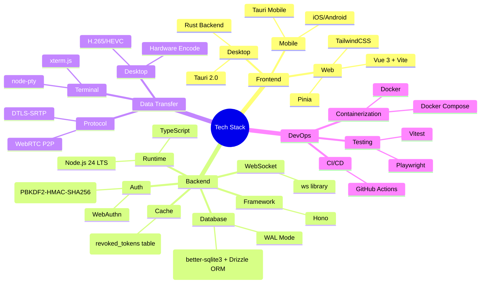
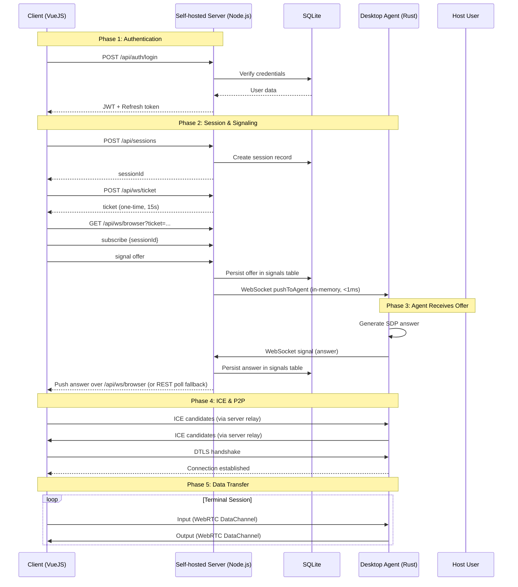
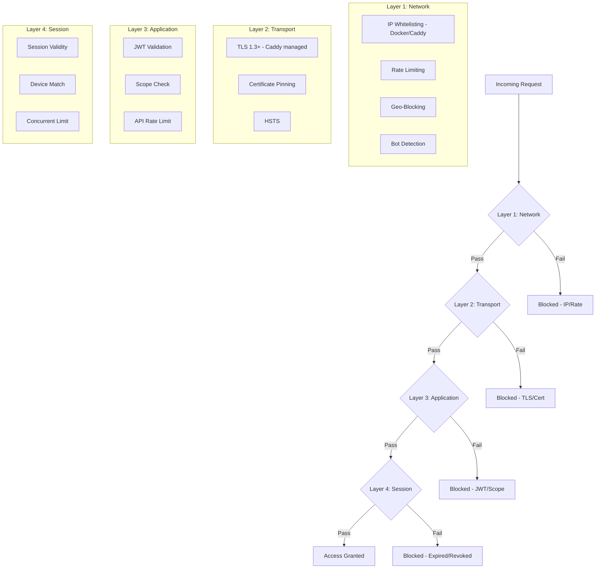
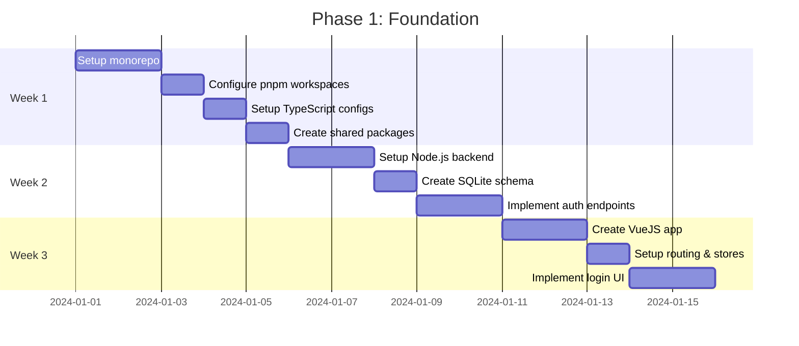

# ARCHITECTURE.md - Remote Access Platform

## 📋 Mục lục

1. [Tổng quan](#1-tổng-quan)
2. [Kiến trúc Hệ thống](#2-kiến-trúc-hệ-thống)
3. [Cấu trúc Monorepo](#3-cấu-trúc-monorepo)
4. [Chi tiết Thành phần](#4-chi-tiết-thành-phần)
5. [Database Schema](#5-database-schema)
6. [API Specification](#6-api-specification)
7. [Bảo mật](#7-bảo-mật)
8. [Lộ trình Triển khai](#8-lộ-trình-triển-khai)
9. [Development Workflow](#9-development-workflow)
10. [Deployment](#10-deployment)
11. [Performance Targets](#11-performance-targets)

---

## 1. Tổng quan

### 1.1 Mục tiêu

Xây dựng nền tảng remote access toàn diện cung cấp:
- **Remote Terminal** với độ trễ < 10ms
- **Remote Desktop** streaming 60fps
- **Remote File Manager** với transfer tốc độ cao
- **Zero-Trust Security** với end-to-end encryption

### 1.2 Nguyên tắc Thiết kế

| Nguyên tắc | Mô tả |
|-----------|-------|
| **Speed First** | Tối ưu mọi layer cho độ trễ thấp nhất |
| **Security by Default** | Zero-trust, E2EE mọi data channel |
| **Cross-Platform** | Web + Desktop + Mobile từ một codebase |
| **Scalable** | Self-hosted Node.js, P2P data transfer |
| **Developer Friendly** | Monorepo, TypeScript-first, clear docs |

### 1.3 Công nghệ Chọn



---

## 2. Kiến trúc Hệ thống

### 2.1 Kiến trúc Tổng thể

Nền tảng Remote Access sử dụng kiến trúc **self-hosted stateful server** với SQLite cục bộ và WebSocket in-memory dispatch. Frontend Vue 3 SPA vẫn được triển khai trên Cloudflare Pages (static hosting only).

```text
                               ┌────────────────────────────────────────┐
                               │       Client (Web Browser)             │
                               │  (Vue 3 SPA hosted on Cloudflare CDN)   │
                               └──────────────────┬─────────────────────┘
                                                  │ HTTPS REST API
                                                  ▼
┌────────────────────────────────────────────────────────────────────────────────────────┐
│ Docker Host / VPS                                                                      │
│                                                                                        │
│   ┌────────────────────────────────────────────────────────────────────────────────┐   │
│   │ apps/server (@ponter/server)                                                   │   │
│   │                                                                                │   │
│   │   • Runtime: Node.js 24 LTS + @hono/node-server + ws                           │   │
│   │   • In-Memory WebSocket Registry: Map<agentId, AgentConnection> (RAM)          │   │
│   │   • Instantaneous Signal Dispatch (< 1ms cross-session forwarding)             │   │
│   │   • Database: SQLite (/app/data/remote.db via better-sqlite3 + Drizzle ORM)    │   │
│   │   • WAL Mode: PRAGMA journal_mode = WAL (high concurrency)                     │   │
│   │   • Token Revocation: SQLite table `revoked_tokens`                            │   │
│   │   • ICE Servers Endpoint: GET /api/webrtc/ice-servers                          │   │
│   └───────────────────────▲────────────────────────────────▲───────────────────────┘   │
│                           │                                │                           │
│     WSS /api/ws/agent     │                                │ STUN/TURN Allocation      │
│                           │                                │ (RFC 5766 Shared Secret)  │
│   ┌───────────────────────┴───────────────┐    ┌───────────┴───────────────────────┐   │
│   │ ponter-agent (Rust Daemon)            │    │ coturn (Dockerized STUN/TURN)     │   │
│   │ (Windows / Linux / macOS)             │    │ Port 3478, Relays: 49152-49200    │   │
│   └───────────────────────────────────────┘    └───────────────────────────────────┘   │
│                                                                                        │
│   WebRTC Peer Connection (DataChannel: "terminal" / PTY)                               │
│   Browser <=======================================================> Agent              │
│               (Direct P2P or Relayed through Coturn TURN)                              │
└────────────────────────────────────────────────────────────────────────────────────────┘
```

### 2.2 Cơ chế WebSocket In-Memory Dispatch

Do Node.js chạy như một quá trình duy nhất và bền vững, `agentConnections` trong `apps/server/src/routes/ws.ts` lưu trữ tham chiếu WebSocket hoạt động trực tiếp trong bộ nhớ RAM:

```typescript
export interface AgentConnection {
  agentId: string;
  userId: string;
  socket: WebSocket;
  send: (data: string) => void;
}

export const agentConnections = new Map<string, AgentConnection>();

export function pushToAgent(agentId: string, message: SignalMessage): boolean {
  const conn = agentConnections.get(agentId);
  if (!conn) return false;
  try {
    conn.send(JSON.stringify({ type: 'signal', data: message }));
    return true;
  } catch {
    return false;
  }
}
```

Khi trình duyệt gửi offer (`POST /api/signal/offer`), `pushToAgent` sẽ ngay lập tức gửi tin nhắn tới WebSocket mở mà không cần qua các isolate, Durable Objects, hay giới hạn subrequest. Nếu không có socket nào kết nối, tín hiệu vẫn được lưu trong SQLite và agent có thể lấy thông qua polling.

**Reconnect logic**: Khi một agent kết nối mới với credential hợp lệ, kết nối cũ sẽ bị đóng với mã 4409 ("Replaced by new connection"). Bảng `agent_connections` luôn duy trì một entry duy nhất cho mỗi `agentId`. Khi socket đóng, entry bị xóa và trạng thái `is_online` trong database được cập nhật thành `false`.

### 2.2.1 Browser Signaling Socket (`/api/ws/browser`)

Chiều ngược lại — server đẩy signal tới browser — cũng dùng WebSocket, thay cho vòng poll `GET /api/signal/poll/:sessionId` (200ms–2000ms). `RESTPollingTransport` vẫn tồn tại và là **fallback** khi WebSocket thất bại.

- **Ticket one-time**: browser không set được `Authorization` header cho WebSocket, nên nó mint một ticket qua `POST /api/ws/ticket` (JWT `type: 'access'`, `scope: 'ws-ticket'`, TTL 15s) rồi mở `GET /api/ws/browser?ticket=...`. `jti` được đăng ký trong registry in-memory (`utils/ws-ticket.ts`) và **consume đúng một lần** ở upgrade, nên ticket lộ qua access log không mở được socket thứ hai.
- **Scope separation hai chiều**: `authMiddleware` từ chối mọi token `scope === 'ws-ticket'` (ticket không dùng được như access token), và `verifyWsTicket` chỉ chấp nhận ticket (access token không dùng được như ticket).
- **Origin check (CSWSH)**: vì xác thực nằm ở query string, `handleBrowserUpgrade` so `Origin` với `CORS_ORIGIN` — cùng policy với REST. Khi `CORS_ORIGIN='*'` thì bỏ qua allowlist.
- **Subscribe + replay**: client gửi `subscribe{sessionId, after}`; server replay các signal bỏ lỡ theo `rowid` (cursor trên wire là UUID `id`), giới hạn 200/trang (`hasMore` để phân trang) và chỉ trong 5 phút gần nhất. Trong lúc replay, live push cho session đó được **buffer** rồi flush sau, dedup theo `id` — đảm bảo không trùng/không sai thứ tự.
- **Liveness**: server `ws.ping()` mỗi 30s (browser tự trả pong ở tầng giao thức, không phụ thuộc JS bị throttle ở tab background); quá 90s không pong → `close(4408)`.
- **Fan-out**: `browserConnections: Map<userId, Set<BrowserConnection>>`; `pushToBrowser` gửi tới mọi tab đang subscribe session (trừ socket gửi), và `DELETE /api/sessions/:id` đẩy `error{SESSION_TERMINATED}` để tab đang chờ handshake biết dừng.
- **Close codes**: 4401 (unauthorized), 4408 (pong timeout), 4409 (agent socket bị thay). Trần frame vào 256KB.
- **Flag build-time**: `VITE_BROWSER_WS_SIGNALING` (`'true'` để bật). WebSocket transport tự reconnect với backoff + jitter và chuyển hẳn sang REST fallback sau `maxRetries`.
- **Graceful shutdown**: SIGTERM đóng mọi signaling socket bằng close code 1001 rồi drain `server.close`; compose đặt `stop_grace_period: 15s` để Docker không SIGKILL giữa chừng.

### 2.3 SQLite Persistence với better-sqlite3

- **Đường dẫn database**: Cấu hình qua biến môi trường `DATABASE_PATH` (mặc định `/app/data/remote.db`).
- **WAL Mode**: `PRAGMA journal_mode = WAL` cho độ trù mật cao và khả năng đọc đồng thời.
- **Tự động migration**: Sử dụng `drizzle-orm/better-sqlite3` với inline schema creation trong `apps/server/src/db/client.ts`.
- **Token revocation**: Bảng `revoked_tokens` lưu `jti` (JWT ID) với `expires_at` để thu hẹp danh sách bị thu hồi.

### 2.4 Dynamic STUN/TURN Credentials (`GET /api/webrtc/ice-servers`)

Để vượt qua firewall và NAT đối xứng:
- Trong môi trường production, coturn sử dụng thông tin xác thực RFC 5766 thời gian giới hạn:
  - `username = "<expiry_unix_timestamp>:<user_id>"`
  - `credential = base64(HMAC-SHA1(TURN_SECRET, username))`
- Endpoint `GET /api/webrtc/ice-servers` trả về cấu hình ICE server động.
- Trong local mode, trả về STUN công cộng mặc định (`stun:stun.l.google.com:19302`).

### 2.5 Sơ đồ Kết nối



### 2.6 Kiến trúc Bảo mật



---

## 3. Cấu trúc Monorepo

### 3.1 Tổng quan

```
ponter/
├── .github/
│   └── workflows/
│       ├── ci.yml                    # CI pipeline
│       ├── deploy.yml                # Deploy frontend to Cloudflare Pages
│       └── build-agent.yml           # Build Rust agent binary for releases
│
├── apps/
│   ├── web/                          # VueJS Web App (Cloudflare Pages)
│   ├── desktop/                      # Tauri Desktop App
│   ├── mobile/                       # Tauri Mobile App
│   ├── agent/                        # Native Rust agent daemon
│   └── server/                       # Self-hosted Node.js backend (@ponter/server)
│
├── packages/
│   ├── shared/                       # Shared TypeScript types, schemas
│   ├── api-client/                   # API client SDK
│   ├── crypto/                       # Crypto utilities
│   ├── terminal-core/                # Terminal manager
│   ├── webrtc-core/                  # WebRTC abstraction
│   └── ui-components/                # Shared Vue components
│
├── docker/                           # Docker packaging for @ponter/server
│   ├── Dockerfile.server
│   ├── docker-compose.local.yml
│   ├── docker-compose.tunnel.yml
│   ├── docker-compose.prod.yml
│   ├── Caddyfile
│   ├── .env.example
│   └── README.md
│
├── docs/
│   ├── ARCHITECTURE.md
│   ├── README.md
│   └── guides/
│       ├── development.md
│       ├── deployment.md
│       ├── agent-setup.md
│       └── terminal-protocol.md
│
├── package.json
├── pnpm-workspace.yaml
├── turbo.json
└── tsconfig.base.json
```

### 3.2 pnpm-workspace.yaml

```yaml
packages:
  - 'apps/*'
  - 'packages/*'
  # apps/server is the self-hosted Node.js + Hono backend.

allowBuilds:
  esbuild: true
  workerd: true
  better-sqlite3: true
```

---

## 4. Chi tiết Thành phần

### 4.1 Web App (VueJS)

**File:** `apps/web/package.json`
```json
{
  "name": "@ponter/web",
  "version": "0.1.0",
  "private": true,
  "scripts": {
    "dev": "vite",
    "build": "vue-tsc && vite build",
    "preview": "vite preview",
    "test": "vitest",
    "typecheck": "vue-tsc --noEmit",
    "deploy": "wrangler deploy"
  },
  "dependencies": {
    "@ponter/shared": "workspace:*",
    "@ponter/api-client": "workspace:*",
    "@ponter/webrtc-core": "workspace:*",
    "@ponter/terminal-core": "workspace:*",
    "@ponter/ui-components": "workspace:*",
    "vue": "^3.4.0",
    "vue-router": "^4.3.0",
    "pinia": "^2.1.0",
    "@vueuse/core": "^10.9.0",
    "xterm": "^5.3.0",
    "xterm-addon-fit": "^0.8.0"
  }
}
```

### 4.2 Self-Hosted Backend (`@ponter/server`)

**File:** `apps/server/package.json`
```json
{
  "name": "@ponter/server",
  "version": "0.1.0",
  "private": true,
  "type": "module",
  "scripts": {
    "dev": "tsx watch src/index.ts",
    "build": "tsc",
    "start": "node dist/index.js",
    "test": "vitest run",
    "lint": "eslint .",
    "typecheck": "tsc --noEmit"
  },
  "dependencies": {
    "@hono/node-server": "^1.13.8",
    "@ponter/shared": "workspace:*",
    "better-sqlite3": "^11.8.1",
    "drizzle-orm": "^0.45.3",
    "hono": "^4.13.9",
    "ws": "^8.18.0"
  }
}
```

**Cấu trúc thư mục:**
```
apps/server/
├── package.json
├── tsconfig.json
├── src/
│   ├── index.ts          # Entrypoint: Node.js HTTP server + WebSocket upgrade
│   ├── app.ts            # Hono app with all REST routes
│   ├── types.ts          # AppEnv & Variables types
│   ├── db/
│   │   ├── client.ts     # better-sqlite3 + Drizzle ORM singleton
│   │   └── schema.ts     # Drizzle SQLite schema
│   ├── middleware/
│   │   ├── auth.ts       # Bearer JWT verification
│   │   ├── cors.ts       # CORS headers
│   │   └── error.ts      # Unified error handling
│   ├── routes/
│   │   ├── auth.ts       # Login, register, refresh, logout
│   │   ├── users.ts      # Profile management
│   │   ├── agents.ts     # Agent registration & tokens
│   │   ├── devices.ts    # Device authorization
│   │   ├── sessions.ts   # Session lifecycle
│   │   ├── signal.ts     # WebRTC offer, answer, ice-candidate endpoints
│   │   ├── webrtc.ts     # Dynamic ICE servers endpoint
│   │   └── ws.ts         # Agent WebSocket handler & dispatcher
│   └── utils/
│       ├── crypto.ts     # PBKDF2, SHA-256 helpers
│       ├── jwt.ts        # JWT sign & verify
│       └── signals.ts    # Signal persistence & helpers
└── test/                 # Vitest suite
```

### 4.3 Docker Packaging (`docker/`)

**Dockerfile.server** — Multi-stage build:
- **Stage 1 (`base`)**: `node:24-alpine` với Corepack/pnpm
- **Stage 2 (`builder`)**: Cài đặt dependencies + biên dịch `@ponter/server`
- **Stage 3 (`runner`)**: Chỉ production deps, `better-sqlite3` native bindings

**Three Compose Setups:**
1. `docker-compose.local.yml` — Local LAN testing (Google STUN, no TURN)
2. `docker-compose.tunnel.yml` — Homelab với Cloudflare Tunnel
3. `docker-compose.prod.yml` — Production VPS với Caddy + Coturn

### 4.4 Desktop Agent (Rust)

**File:** `apps/agent/Cargo.toml`
```toml
[package]
name = "ponter-agent"
version = "0.1.0"
edition = "2021"

[dependencies]
webrtc = "0.13"
tokio = { version = "1.0", features = ["full"] }
tokio-tungstenite = "0.26"
portable-pty = "0.9"
base64 = "0.23"
clap = { version = "4.0", features = ["derive"] }
serde = { version = "1.0", features = ["derive"] }
serde_json = "1.0"
tracing = "0.1"
tracing-subscriber = "0.1"
anyhow = "1.0"
futures-util = "0.7"
```

---

## 5. Database Schema

### 5.1 SQLite Schema (`apps/server/src/db/client.ts`)

Database được tạo tự động qua inline SQL trong hàm `runMigrations()`:

```sql
-- Users table
CREATE TABLE IF NOT EXISTS users (
    id TEXT PRIMARY KEY,
    username TEXT NOT NULL UNIQUE,
    email TEXT UNIQUE,
    public_key TEXT NOT NULL,
    password_hash TEXT,
    is_active INTEGER NOT NULL DEFAULT 1,
    created_at TEXT NOT NULL DEFAULT (datetime('now')),
    updated_at TEXT NOT NULL DEFAULT (datetime('now')),
    last_login_at TEXT,
    metadata TEXT
);

-- User devices
CREATE TABLE IF NOT EXISTS devices (
    id TEXT PRIMARY KEY,
    user_id TEXT NOT NULL,
    device_name TEXT,
    device_type TEXT NOT NULL,
    fingerprint TEXT NOT NULL UNIQUE,
    is_trusted INTEGER NOT NULL DEFAULT 0,
    last_seen_at TEXT,
    created_at TEXT NOT NULL DEFAULT (datetime('now')),
    FOREIGN KEY (user_id) REFERENCES users(id) ON DELETE CASCADE
);

-- Agents (remote hosts)
CREATE TABLE IF NOT EXISTS agents (
    id TEXT PRIMARY KEY,
    user_id TEXT NOT NULL,
    hostname TEXT,
    platform TEXT,
    os_version TEXT,
    agent_version TEXT,
    public_key TEXT NOT NULL,
    is_online INTEGER NOT NULL DEFAULT 0,
    last_ping_at TEXT,
    credential_hash TEXT UNIQUE,
    capabilities TEXT,
    created_at TEXT NOT NULL DEFAULT (datetime('now')),
    FOREIGN KEY (user_id) REFERENCES users(id) ON DELETE CASCADE
);

-- Sessions
CREATE TABLE IF NOT EXISTS sessions (
    id TEXT PRIMARY KEY,
    user_id TEXT NOT NULL,
    device_id TEXT,
    agent_id TEXT,
    status TEXT NOT NULL DEFAULT 'pending',
    started_at TEXT NOT NULL DEFAULT (datetime('now')),
    ended_at TEXT,
    created_at TEXT NOT NULL DEFAULT (datetime('now')),
    updated_at TEXT NOT NULL DEFAULT (datetime('now')),
    FOREIGN KEY (user_id) REFERENCES users(id) ON DELETE CASCADE,
    FOREIGN KEY (device_id) REFERENCES devices(id) ON DELETE SET NULL,
    FOREIGN KEY (agent_id) REFERENCES agents(id) ON DELETE SET NULL
);

-- WebRTC Signals (polling fallback)
CREATE TABLE IF NOT EXISTS signals (
    id TEXT PRIMARY KEY,
    session_id TEXT NOT NULL,
    type TEXT NOT NULL,
    payload TEXT NOT NULL,
    created_at TEXT NOT NULL DEFAULT (datetime('now')),
    expires_at TEXT,
    FOREIGN KEY (session_id) REFERENCES sessions(id) ON DELETE CASCADE
);

-- Token Revocation (replaces Cloudflare KV blacklist)
CREATE TABLE IF NOT EXISTS revoked_tokens (
    jti TEXT PRIMARY KEY,
    expires_at INTEGER NOT NULL,
    created_at TEXT NOT NULL DEFAULT (datetime('now'))
);

-- Indexes
CREATE INDEX IF NOT EXISTS signals_session_created_idx ON signals(session_id, created_at);
CREATE INDEX IF NOT EXISTS idx_revoked_tokens_expires ON revoked_tokens(expires_at);
```

### 5.2 WAL Mode & Connection Management

```typescript
// apps/server/src/db/client.ts
const sqlite = new BetterSqlite3(dbPath);
sqlite.exec('PRAGMA journal_mode = WAL;');
sqlite.exec('PRAGMA foreign_keys = ON;');
sqlite.exec('PRAGMA busy_timeout = 5000;');
```

---

## 6. API Specification

### 6.1 Authentication Endpoints

```typescript
// packages/shared/src/types/auth.ts
export interface LoginRequest {
  username: string;
  password?: string;
  webauthnCredential?: Credential;
}

export interface LoginResponse {
  token: string;
  refreshToken: string;
  user: User;
  expiresIn: number;
}

export interface RegisterRequest {
  username: string;
  email: string;
  password: string;
  publicKey: string;
}
```

### 6.2 REST API Routes

```
# Authentication
POST   /api/auth/register          # Register new user
POST   /api/auth/login             # Login
POST   /api/auth/refresh           # Refresh token
POST   /api/auth/logout            # Logout (revoke token in SQLite)

# Agents
GET    /api/agents                 # List user's agents
POST   /api/agents                 # Register new agent (mints ag_ credential)
GET    /api/agents/:id             # Get agent details

# Sessions
POST   /api/sessions               # Create new session
GET    /api/sessions               # List sessions
GET    /api/sessions/:id           # Get session details
DELETE /api/sessions/:id           # Terminate session

# Signaling
POST   /api/signal/offer           # Send WebRTC offer (persisted + WebSocket push)
POST   /api/signal/answer          # Send WebRTC answer
POST   /api/signal/ice-candidate   # Send ICE candidate
GET    /api/signal/poll/:sessionId # Poll for signals (browser fallback)

# WebRTC
GET    /api/webrtc/ice-servers     # Dynamic ICE server config (TURN credentials)

# Agent WebSocket
GET    /api/ws/agent               # Agent WebSocket (Bearer ag_ credential, not JWT)

# Browser WebSocket signaling
POST   /api/ws/ticket              # Mint one-time WS ticket (Bearer JWT, TTL 15s)
GET    /api/ws/browser?ticket=...  # Browser signaling socket (subscribe/replay/push)
```

### 6.3 Agent WebSocket Protocol

```typescript
// packages/shared/src/types/signaling.ts

export type AgentSocketMessage =
  | { type: 'ping' }
  | { type: 'pong' }
  | { type: 'signal'; data: SignalMessage }
  | { type: 'error'; code: AgentErrorCode };

export type AgentErrorCode =
  | 'MALFORMED_JSON'
  | 'VALIDATION_ERROR'
  | 'NOT_FOUND'
  | 'INTERNAL_SERVER_ERROR'
  | 'SESSION_NOT_ACTIVE';
```

**Handshake flow:**
1. Agent opens WebSocket to `ws://localhost:8787/api/ws/agent`
2. Agent sends `Authorization: Bearer ag_<32hex>` header (credential, not JWT)
3. Server verifies credential hash against `agents.credential_hash` in SQLite
4. On success, server upgrades connection and registers in `agentConnections` map
5. Agent sends `ping` frames every 30s; server updates `last_ping_at`
6. Server pushes signals via `pushToAgent()` for sub-1ms delivery

**Week 5 Agent Credential Boundary:**
- `POST /api/agents` mints `ag_` + 32 lowercase hex characters (128 bits of CSPRNG entropy)
- Credential stored as SHA-256 hex digest in `agents.credential_hash`
- WebSocket handshake enforces tenancy: `session.userId == agent.userId` AND `session.agentId == agent.id`
- Unauthenticated requests receive HTTP 401 before upgrade completes

### 6.4 Browser WebSocket Protocol

```typescript
// packages/shared/src/types/signaling.ts

// Client -> Server
export type BrowserMessageInit =
  | { type: 'subscribe'; data: { sessionId: string; after?: string | null } }
  | { type: 'signal'; data: SignalMessage }
  | { type: 'ping' };

// Server -> Client
export type BrowserSocketMessage =
  | { type: 'pong' }
  | { type: 'signal'; data: SignalMessage; id: string }
  | { type: 'subscribed'; data: { sessionId: string; after: string | null; hasMore: boolean } }
  | { type: 'error'; code: BrowserErrorCode };

export type BrowserErrorCode =
  | 'MALFORMED_JSON' | 'VALIDATION_ERROR' | 'NOT_FOUND'
  | 'UNAUTHORIZED' | 'TICKET_EXPIRED' | 'SESSION_TERMINATED'
  | 'INTERNAL_SERVER_ERROR';
```

**Handshake flow:**
1. Browser mints `POST /api/ws/ticket` (Bearer access token) → one-time ticket, TTL 15s
2. Browser opens `ws://<host>/api/ws/browser?ticket=...`; server verifies the ticket signature, its `scope === 'ws-ticket'`, the Origin allowlist, and consumes the `jti` (one-time)
3. Browser sends `subscribe{sessionId, after}`; server replays missed signals (rowid order, ≤200/page, ≤5 min) and acks `subscribed`
4. Browser sends `signal` frames; server persists + `pushToAgent`, and fans out to the user's other subscribed sockets
5. Server pushes `signal` frames to the tab as the agent produces them — no poll loop
6. `error{SESSION_TERMINATED}` is pushed when the session ends (e.g. `DELETE /api/sessions/:id`)

---

## 7. Bảo mật

### 7.1 Zero-Trust Implementation

Tự động hóa xác thực thông qua JWT (truy cập 15 phút, làm mới 7 ngày). Bảng `revoked_tokens` trong SQLite thay thế cho Cloudflare KV blacklist:

```typescript
// apps/server/src/middleware/auth.ts (actual implementation)
import type { MiddlewareHandler } from 'hono';
import type { AppContext } from '../types.js';
import { AppError } from './error.js';
import { verifyTokenForUser } from '../utils/auth.js';

const MISSING_HEADER = 'Missing or invalid Authorization header';

function extractBearerToken(header: string | undefined): string {
  if (!header?.startsWith('Bearer ')) {
    throw new AppError(MISSING_HEADER, 401, 'UNAUTHORIZED');
  }
  const token = header.slice('Bearer '.length).trim();
  if (!token) {
    throw new AppError(MISSING_HEADER, 401, 'UNAUTHORIZED');
  }
  return token;
}

export const authMiddleware: MiddlewareHandler<AppContext> = async (c, next) => {
  const token = extractBearerToken(c.req.header('Authorization'));
  const { payload, user } = await verifyTokenForUser(
    c, token, process.env.JWT_SECRET!, 'access',
    { invalid: { message: 'Invalid or expired token', code: 'UNAUTHORIZED' },
      wrongType: { message: 'Invalid token type', code: 'UNAUTHORIZED' },
      revoked: { message: 'Token has been revoked', code: 'UNAUTHORIZED' },
      inactive: { message: 'User is inactive or not found', code: 'UNAUTHORIZED' } });
  c.set('user', user);
  c.set('tokenPayload', payload);
  await next();
};
```

### 7.2 E2EE Implementation

> **⚠️ Trạng thái thực tế (2026-10-01):** phần dưới đây là **thiết kế mục tiêu**, chưa được hiện thực. `packages/crypto/src/encrypt.ts` và class `EncryptionManager` **chưa tồn tại** trong mã nguồn. E2EE tầng ứng dụng là hạng mục chính của **Phase 5 (Tuần 12-14)** — work list đã được audit adversarial xác minh: [`docs/security/2026-10-01-e2ee-zero-trust-audit.md`](./security/2026-10-01-e2ee-zero-trust-audit.md).

```typescript
// packages/crypto/src/encrypt.ts
export class EncryptionManager {
  private keyPair: CryptoKeyPair;
  private sharedKey: CryptoKey;

  async initialize(privateKeyJwk: JsonWebKey, peerPublicKeyJwk: JsonWebKey) {
    const privateKey = await crypto.subtle.importKey(
      'jwk',
      privateKeyJwk,
      { name: 'ECDH', namedCurve: 'P-256' },
      false,
      ['deriveKey']
    );

    const peerPublicKey = await crypto.subtle.importKey(
      'jwk',
      peerPublicKeyJwk,
      { name: 'ECDH', namedCurve: 'P-256' },
      false,
      []
    );

    this.sharedKey = await crypto.subtle.deriveKey(
      { name: 'ECDH', public: peerPublicKey },
      privateKey,
      { name: 'AES-GCM', length: 256 },
      false,
      ['encrypt', 'decrypt']
    );
  }

  async encrypt(data: ArrayBuffer): Promise<ArrayBuffer> {
    const iv = crypto.getRandomValues(new Uint8Array(12));
    const encrypted = await crypto.subtle.encrypt(
      { name: 'AES-GCM', iv },
      this.sharedKey,
      data
    );

    const result = new ArrayBuffer(12 + encrypted.byteLength);
    const view = new Uint8Array(result);
    view.set(iv, 0);
    view.set(new Uint8Array(encrypted), 12);

    return result;
  }

  async decrypt(data: ArrayBuffer): Promise<ArrayBuffer> {
    const view = new Uint8Array(data);
    const iv = view.slice(0, 12);
    const encrypted = view.slice(12);

    return await crypto.subtle.decrypt(
      { name: 'AES-GCM', iv },
      this.sharedKey,
      encrypted
    );
  }
}
```

### 7.3 Password Hashing

Sử dụng PBKDF2-HMAC-SHA256 với Web Crypto API:

```typescript
// apps/server/src/utils/crypto.ts
export async function hashPassword(password: string, salt?: string): Promise<string> {
  const actualSalt = salt ?? crypto.randomUUID();
  const encoded = new TextEncoder().encode(password);
  const keyMaterial = await crypto.subtle.importKey(
    'raw',
    encoded,
    { name: 'PBKDF2' },
    false,
    ['deriveBits']
  );

  const derivedBits = await crypto.subtle.deriveBits(
    {
      name: 'PBKDF2',
      salt: new TextEncoder().encode(actualSalt),
      iterations: 100_000,
      hash: 'SHA-256',
    },
    keyMaterial,
    256
  );

  const hash = Buffer.from(derivedBits).toString('hex');
  return `${actualSalt}:${hash}`;
}
```

---

## 8. Lộ trình Triển khai

### Phase 1: Foundation (Tuần 1-3)



#### Tuần 1: Monorepo Setup
- [x] Khởi tạo pnpm workspace
- [x] Cấu hình Turborepo
- [x] Tạo cấu trúc folders
- [x] Setup TypeScript base config
- [x] Tạo packages/shared với types
- [x] Setup ESLint + Prettier
- [x] Tạo GitHub Actions CI

#### Tuần 2: Backend Foundation
- [x] Tạo self-hosted Node.js backend (`apps/server`)
- [x] Setup SQLite + migrations (better-sqlite3 + Drizzle ORM)
- [x] Implement JWT authentication
- [x] Tạo API endpoints cơ bản
- [x] Token revocation via SQLite `revoked_tokens` table
- [x] Viết unit tests

#### Tuần 3: Frontend Foundation
- [x] Tạo VueJS app với Vite
- [x] Setup TailwindCSS + theme
- [x] Implement routing (vue-router)
- [x] Tạo auth pages (login/register)
- [x] Setup Pinia stores

### Phase 2: WebRTC & Terminal (Tuần 4-6)

#### Tuần 4: WebRTC Core
- [ ] Tạo packages/webrtc-core
- [ ] Implement signaling client
- [ ] Xử lý ICE/STUN/TURN
- [ ] Tạo data channels
- [ ] Test kết nối P2P

#### Tuần 5: Desktop Agent - Terminal
- [ ] Tạo Rust agent — `apps/agent` (crate `ponter-agent`)
- [ ] Implement WebSocket signaling — `GET /api/ws/agent` trên `@ponter/server`
- [ ] Tích hợp portable-pty — PTY thật, 1 session
- [ ] Xử lý terminal I/O — kênh `terminal`
- [ ] Implement session management

#### Tuần 6: Terminal UI
- [ ] Tích hợp xterm.js
- [ ] Kết nối data channel với terminal
- [ ] Implement multi-tab terminal
- [ ] Handle resize events

### Phase 3: Desktop Streaming (Tuần 7-9)

> **Trạng thái:** Tuần 7 là *thin slice* đã hoàn thành — xem view-only, ~720p @ 15fps, H.264 phần mềm (openh264). Tuần 8-9 (chất lượng hình ảnh, điều khiển chuột/phím, hardening) là hạng mục sắp tới.

#### Tuần 7: Desktop Streaming — lát cắt mỏng (đã xong)
- [x] `packages/webrtc-core` — seam media tuỳ chọn (`addTransceiver`/`onTrack`) + `media-channel.ts` (đóng ADR-06)
- [x] `packages/desktop-core` — `DesktopClient` không phụ thuộc DOM
- [x] Agent Rust — `desktop.rs` (capture → downscale → openh264) + nhánh trả lời desktop trong `rtc.rs`
- [x] Web — tab desktop trong workspace, độc quyền theo agent (ADR-19)
- [x] E2E cross-language (`desktop.e2e.test.ts`) + demo thủ công trên Chrome

#### Tuần 8-9: Chất lượng & tương tác (sắp tới)
- [ ] Tăng chất lượng/khung hình, adaptive bitrate
- [ ] Điều khiển chuột & bàn phím (input forwarding) — hiện chỉ view-only (ADR-18)
- [ ] Chọn màn hình/cửa sổ, codec phần cứng

### Phase 4: File Transfer (Tuần 10-11)

> **Chưa thiết kế.** Mục này được giữ chỗ để lộ trình không nhảy cóc từ Phase 3 sang Phase 5; nội dung chi tiết sẽ bổ sung khi có spec riêng.

### Phase 5: E2EE & Security & Polish (Tuần 12-14)

> **Đọc trước khi bắt đầu Phase 5:** [`docs/security/2026-10-01-e2ee-zero-trust-audit.md`](./security/2026-10-01-e2ee-zero-trust-audit.md) — audit adversarial E2EE/Zero-Trust (28 findings đã xác minh kèm evidence file:line) và work list chi tiết (WS1-WS5).

- [ ] **WS1 — Application-layer E2EE:** hiện thực `EncryptionManager` (ECDH P-256 + AES-GCM-256), wire vào terminal-core và Rust agent
- [ ] **WS2 — Peer identity & signaling integrity:** xác minh DTLS fingerprint ngoài băng, keypair thật cho agent, chống MITM signaling
- [ ] **WS3 — Agent session hardening:** shell allowlist, enforce cờ `approved`, xử lý WS close code, validate `candidate.session_id`
- [ ] **WS4 — Auth hardening:** login rate-limit, refresh token rotation, JWT secret startup validation, WS revocation, siết `CORS_ORIGIN`
- [ ] **WS5 — Web/ops polish:** CSP + security headers, token storage, coturn hardening, bỏ default secret

---

## 9. Development Workflow

### 9.1 Local Development

```bash
# Clone repository
git clone https://github.com/ngotuananh101/ponter.git
cd ponter

# Install dependencies
pnpm install

# Build the native Rust agent
cargo build --manifest-path apps/agent/Cargo.toml
```

### 9.2 Running Services Locally

Chạy từng thành phần trong terminal riêng:

```bash
# Terminal 1: Start the Backend (Node.js + Hono + SQLite)
pnpm --filter @ponter/server dev

# Terminal 2: Start the Web Client (Vite on http://127.0.0.1:5173)
pnpm --filter @ponter/web dev

# Terminal 3: Run the Native Agent Daemon
cargo run --manifest-path apps/agent/Cargo.toml -- \
  --agent-id agent-local-01 \
  --server ws://127.0.0.1:8787/api/ws/agent \
  --credential <AGENT_CREDENTIAL> \
  --stun ""
```

**Health check:**
```bash
curl http://127.0.0.1:8787/health
# {"status":"ok"}
```

### 9.3 Environment Variables

**File:** `.env.example`
```env
# Backend
DATABASE_PATH=./data/remote.db
PORT=8787
JWT_SECRET=local-dev-jwt-secret-key-32-chars-min
REFRESH_TOKEN_SECRET=local-dev-refresh-secret-key-32-chars
CORS_ORIGIN=*

# TURN (production only)
TURN_SECRET=
TURN_URL=turn:your-domain.com:3478
STUN_URL=stun:your-domain.com:3478

# Web App
VITE_API_URL=http://localhost:8787
```

### 9.4 Testing Strategy

```bash
# JS unit + integration tests
pnpm test

# Server-specific tests
pnpm --filter @ponter/server test

# Rust unit tests
cargo test --manifest-path apps/agent/Cargo.toml
```

---

## 10. Deployment

### 10.1 Self-Hosted Backend (Docker Compose)

Xem [Deployment Guide](guides/deployment.md) để hướng dẫn chi tiết cho ba môi trường:
- **Local LAN**: `docker-compose.local.yml`
- **Homelab**: `docker-compose.tunnel.yml` (Cloudflare Tunnel)
- **Production VPS**: `docker-compose.prod.yml` (Caddy + Coturn)

### 10.2 Web Frontend (Cloudflare Pages)

Web client (`apps/web`) được triển khai như static assets trên Cloudflare Pages:

```bash
# Build
pnpm --filter @ponter/web build

# Deploy to Cloudflare Pages
pnpm --filter @ponter/web exec wrangler deploy
```

### 10.3 Desktop Agent

```bash
# Build for current platform
cd apps/agent
cargo build --release

# Build for all platforms
cargo build --release --target x86_64-pc-windows-msvc
cargo build --release --target x86_64-apple-darwin
cargo build --release --target aarch64-apple-darwin
cargo build --release --target x86_64-unknown-linux-gnu
```

---

## 11. Performance Targets

| Metric | Target | Method |
|--------|--------|--------|
| Terminal Latency | < 10ms | P2P DataChannel |
| Desktop stream (Week 7) | ~720p @ 15fps, view-only | Software H.264 (openh264) |
| Desktop stream (Phase 3 target) | 60fps | Hardware H.265 |
| File Transfer | > 10MB/s | Parallel chunks |
| Connection Time | < 500ms | 0-RTT QUIC |
| Memory Usage | < 100MB | Optimized agent |
| Bundle Size | < 5MB | Tree-shaking |

---

## 🤝 Contributing

Xem [CONTRIBUTING.md](./CONTRIBUTING.md) để biết hướng dẫn chi tiết.

---

## 📄 License

MIT License - xem [LICENSE](./LICENSE)