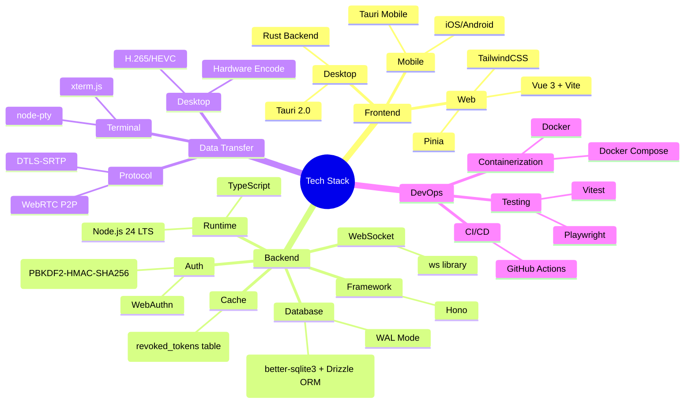
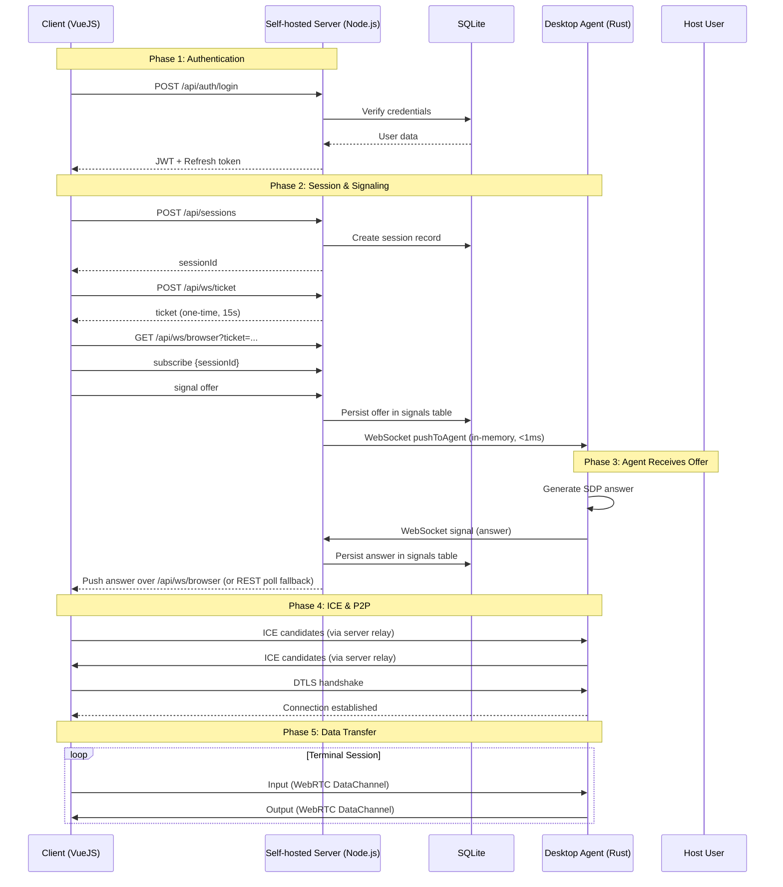
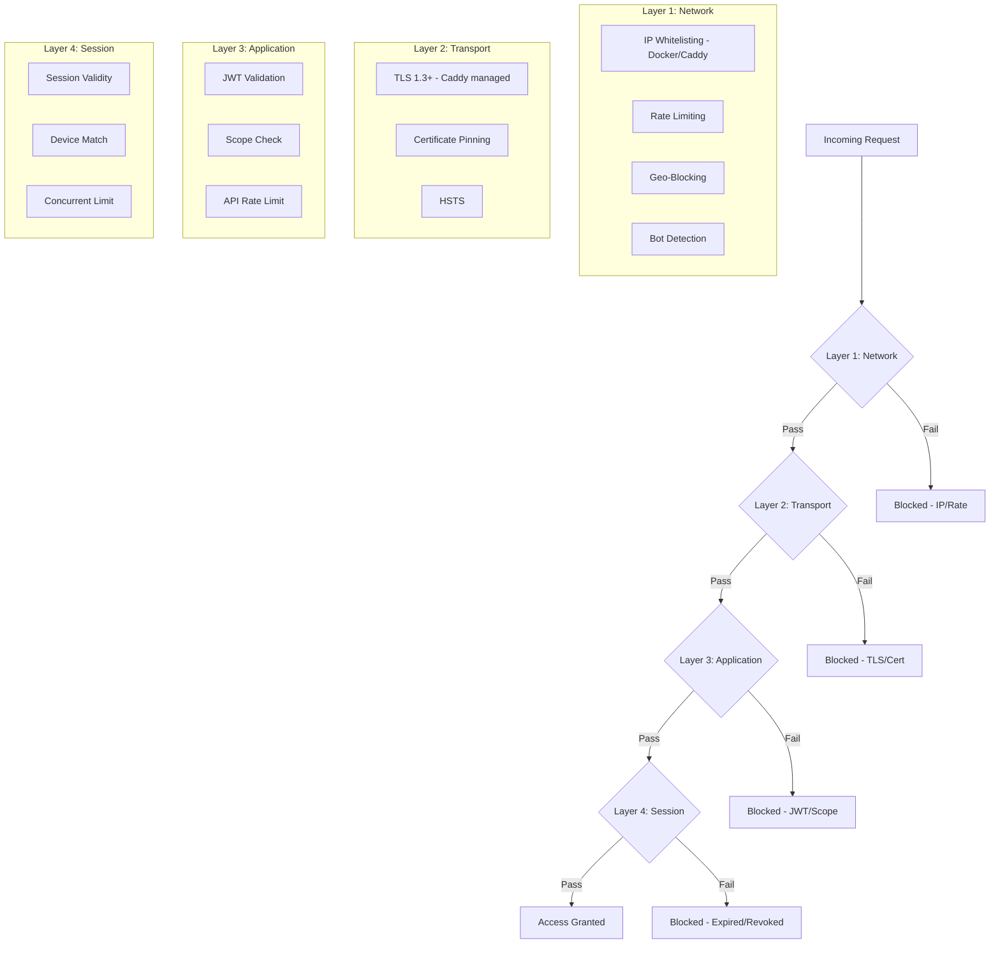
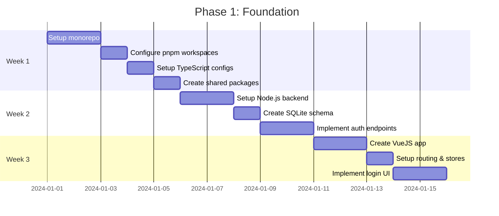

# ARCHITECTURE.md - Remote Access Platform

## 📋 Table of Contents

1. [Overview](#1-overview)
2. [System Architecture](#2-system-architecture)
3. [Monorepo Structure](#3-monorepo-structure)
4. [Component Details](#4-component-details)
5. [Database Schema](#5-database-schema)
6. [API Specification](#6-api-specification)
7. [Security](#7-security)
8. [Implementation Roadmap](#8-implementation-roadmap)
9. [Development Workflow](#9-development-workflow)
10. [Deployment](#10-deployment)
11. [Performance Targets](#11-performance-targets)

---

## 1. Overview

### 1.1 Objectives

Build a comprehensive remote access platform providing:
- **Remote Terminal** with < 10ms latency
- **Remote Desktop** streaming 60fps
- **Remote File Manager** with high-speed transfer
- **Zero-Trust Security** (auth implemented; peer identity & application-layer E2EE — Phase 5)

### 1.2 Design Principles

| Principle | Description |
|-----------|-------|
| **Speed First** | Optimize every layer for minimal latency |
| **Security by Default** | Zero-trust (auth implemented); peer identity & application-layer E2EE — Phase 5 (does not apply to video/file transfer) |
| **Cross-Platform** | Web + Desktop + Mobile from a unified codebase |
| **Scalable** | Self-hosted Node.js, P2P data transfer |
| **Developer Friendly** | Monorepo, TypeScript-first, clear docs |

### 1.3 Technology Choices



---

## 2. System Architecture

### 2.1 Overall Architecture

The Remote Access Platform uses a **self-hosted stateful server** architecture with local SQLite and in-memory WebSocket dispatch. The Vue 3 SPA frontend remains deployed on Cloudflare Pages (static hosting only).

```text
                               ┌────────────────────────────────────────┐
                               │       Client (Web Browser)             │
                               │  (Vue 3 SPA hosted on Cloudflare CDN)   │
                               └──────────────────┬─────────────────────┘
                                                  │ HTTPS REST API
                                                  ▼
┌────────────────────────────────────────────────────────────────────────────────────────┐
│ Docker Host / VPS                                                                      │
│                                                                                        │
│   ┌────────────────────────────────────────────────────────────────────────────────┐   │
│   │ apps/server (@ponter/server)                                                   │   │
│   │                                                                                │   │
│   │   • Runtime: Node.js 24 LTS + @hono/node-server + ws                           │   │
│   │   • In-Memory WebSocket Registry: Map<agentId, AgentConnection> (RAM)          │   │
│   │   • Instantaneous Signal Dispatch (< 1ms cross-session forwarding)             │   │
│   │   • Database: SQLite (/app/data/remote.db via better-sqlite3 + Drizzle ORM)    │   │
│   │   • WAL Mode: PRAGMA journal_mode = WAL (high concurrency)                     │   │
│   │   • Token Revocation: SQLite table `revoked_tokens`                            │   │
│   │   • ICE Servers Endpoint: GET /api/webrtc/ice-servers                          │   │
│   └───────────────────────▲────────────────────────────────▲───────────────────────┘   │
│                           │                                │                           │
│     WSS /api/ws/agent     │                                │ STUN/TURN Allocation      │
│                           │                                │ (RFC 5766 Shared Secret)  │
│   ┌───────────────────────┴───────────────┐    ┌───────────┴───────────────────────┐   │
│   │ ponter-agent (Rust Daemon)            │    │ coturn (Dockerized STUN/TURN)     │   │
│   │ (Windows / Linux / macOS)             │    │ Port 3478, Relays: 49152-49200    │   │
│   └───────────────────────────────────────┘    └───────────────────────────────────┘   │
│                                                                                        │
│   WebRTC Peer Connection (DataChannel: "terminal" / PTY)                               │
│   Browser <=======================================================> Agent              │
│               (Direct P2P or Relayed through Coturn TURN)                              │
└────────────────────────────────────────────────────────────────────────────────────────┘
```

### 2.2 In-Memory WebSocket Dispatch Mechanism

Because Node.js runs as a single persistent process, `agentConnections` in `apps/server/src/routes/ws.ts` stores active WebSocket references directly in RAM:

```typescript
export interface AgentConnection {
  agentId: string;
  userId: string;
  socket: WebSocket;
  send: (data: string) => void;
}

export const agentConnections = new Map<string, AgentConnection>();

export function pushToAgent(agentId: string, message: SignalMessage): boolean {
  const conn = agentConnections.get(agentId);
  if (!conn) return false;
  try {
    conn.send(JSON.stringify({ type: 'signal', data: message }));
    return true;
  } catch {
    return false;
  }
}
```

When the browser sends an offer (`POST /api/signal/offer`), `pushToAgent` immediately sends the message to the open WebSocket without crossing isolates, Durable Objects, or subrequest limits. If no socket is connected, signals remain stored in SQLite and the agent can retrieve them via polling.

**Reconnect logic**: When an agent establishes a new connection with valid credentials, the previous connection is closed with code 4409 ("Replaced by new connection"). The `agent_connections` table maintains a single entry per `agentId`. When the socket closes, the entry is removed and `is_online` status in the database updates to `false`.

### 2.2.1 Browser Signaling Socket (`/api/ws/browser`)

In the reverse direction — server pushing signals to the browser — WebSockets are also used, replacing the `GET /api/signal/poll/:sessionId` polling loop (200ms–2000ms). `RESTPollingTransport` remains as a **fallback** if WebSocket fails.

- **Single-use ticket**: The browser cannot set an `Authorization` header on WebSockets, so it mints a ticket via `POST /api/ws/ticket` (JWT `type: 'access'`, `scope: 'ws-ticket'`, TTL 15s) and opens `GET /api/ws/browser?ticket=...`. The `jti` is registered in an in-memory registry (`utils/ws-ticket.ts`) and **consumed exactly once** during upgrade, ensuring tickets leaked in access logs cannot open a second socket.
- **Bidirectional scope separation**: `authMiddleware` rejects any token with `scope === 'ws-ticket'` (tickets cannot act as access tokens), and `verifyWsTicket` only accepts tickets (access tokens cannot act as tickets).
- **Origin check (CSWSH)**: Because authentication is in the query string, `handleBrowserUpgrade` compares `Origin` against `CORS_ORIGIN` — same policy as REST. When `CORS_ORIGIN='*'`, allowlist checking is bypassed.
- **Subscribe + replay**: The client sends `subscribe{sessionId, after}`; the server replays missed signals ordered by `rowid` (wire cursor is UUID `id`), capped at 200/page (`hasMore` for pagination) and limited to the last 5 minutes. During replay, live pushes for that session are **buffered** and flushed afterwards, deduplicated by `id` — ensuring no duplicates or out-of-order delivery.
- **Liveness**: The server issues `ws.ping()` every 30s (browsers automatically respond with pong at the protocol level, independent of JS background tab throttling); exceeding 90s without pong triggers `close(4408)`.
- **Fan-out**: `browserConnections: Map<userId, Set<BrowserConnection>>`; `pushToBrowser` broadcasts to all tabs subscribed to the session (except sender), and `DELETE /api/sessions/:id` pushes `error{SESSION_TERMINATED}` so tabs awaiting handshake terminate cleanly.
- **Fleet push (ADR-73..77)**: The same socket also carries a coarse `{type:'fleet-changed'}` invalidation so the Dashboard stops polling. A connection opts in with `{type:'subscribe-fleet'}` / `{type:'unsubscribe-fleet'}` (per-connection `fleetSubscribed` flag); `pushFleetToUser(userId)` fans the frame out best-effort — never throwing, per-connection `try/catch` — to the user's subscribed sockets whenever the *observable* fleet changes: agent connect/disconnect (agent WS server) and agent/device create/update/delete (`agents.ts` / `devices.ts`). Tenancy is structural: the fan-out iterates only `browserConnections.get(userId)`. On receipt the Dashboard refetches `GET /api/devices` + `GET /api/agents` (debounced ≥500 ms) and keeps a 60 s poll as the safety net. The consumer is a dedicated `apps/web/src/services/fleet-socket.ts` + `apps/web/src/stores/fleet.ts` (the session-scoped transport is not reused), gated by the same `VITE_BROWSER_WS_SIGNALING` flag.
- **Close codes**: 4401 (unauthorized), 4408 (pong timeout), 4409 (agent socket replaced). Inbound frame ceiling is 256KB.
- **Build-time flag**: `VITE_BROWSER_WS_SIGNALING` (`'true'` to enable). WebSocket transport automatically reconnects with backoff + jitter and falls back permanently to REST after `maxRetries`.
- **Graceful shutdown**: SIGTERM closes all signaling sockets with close code 1001 before draining `server.close`; compose sets `stop_grace_period: 15s` so Docker does not issue premature SIGKILL.

### 2.3 SQLite Persistence with better-sqlite3

- **Database path**: Configured via the `DATABASE_PATH` environment variable (default `/app/data/remote.db`).
- **WAL Mode**: `PRAGMA journal_mode = WAL` for high concurrency and read throughput.
- **Automatic migrations**: Uses `drizzle-orm/better-sqlite3` with inline schema creation in `apps/server/src/db/client.ts`.
- **Token revocation**: The `revoked_tokens` table stores `jti` (JWT ID) with `expires_at` to prune revoked records over time.

### 2.4 Dynamic STUN/TURN Credentials (`GET /api/webrtc/ice-servers`)

To traverse firewalls and symmetric NAT:
- In production, coturn uses RFC 5766 time-limited credentials:
  - `username = "<expiry_unix_timestamp>:<user_id>"`
  - `credential = base64(HMAC-SHA1(TURN_SECRET, username))`
- The `GET /api/webrtc/ice-servers` endpoint returns dynamic ICE server configurations.
- In local mode, returns default public STUN (`stun:stun.l.google.com:19302`).

### 2.5 Connection Flow



### 2.6 Security Architecture

> **⚠️ Actual Status (2026-10-05):** The diagram below represents target defense architecture. The following controls are **not yet implemented**: IP whitelisting (B1), geo-blocking (B3), bot detection (B4), certificate pinning (C2), HSTS (C3), device match (E2). Several controls have partial implementation: rate limiting (B2/D3) applies only to login (`/api/auth/login`); TLS (C1) terminates at Caddy/Let's Encrypt but does not pin TLS 1.3+. Implemented: JWT validation (D1), scope check (D2), session validity (E1), concurrent limit (E3).



---

## 3. Monorepo Structure

### 3.1 Overview

```
ponter/
├── .github/
│   └── workflows/
│       ├── ci-node.yml               # CI: Node/TS lint, typecheck, tests
│       ├── ci-docker.yml             # CI: server Docker image build
│       ├── ci-e2e.yml                # CI: cross-language terminal E2E
│       ├── build-agent.yml           # Build/verify Rust agent (6 targets)
│       ├── deploy.yml                # Deploy frontend to Cloudflare Pages
│       └── docker-publish.yml        # Publish server image to Docker Hub (manual)
│
├── apps/
│   ├── web/                          # VueJS Web App (Cloudflare Pages)
│   ├── desktop/                      # Tauri Desktop App
│   ├── mobile/                       # Tauri Mobile App
│   ├── agent/                        # Native Rust agent daemon
│   └── server/                       # Self-hosted Node.js backend (@ponter/server)
│
├── packages/
│   ├── shared/                       # Shared TypeScript types, schemas
│   ├── api-client/                   # API client SDK
│   ├── crypto/                       # Crypto utilities
│   ├── terminal-core/                # Terminal manager
│   ├── webrtc-core/                  # WebRTC abstraction
│   └── ui-components/                # Shared Vue components
│
├── docker/                           # Docker packaging for @ponter/server
│   ├── Dockerfile.server
│   ├── docker-compose.local.yml
│   ├── docker-compose.tunnel.yml
│   ├── docker-compose.prod.yml
│   ├── Caddyfile
│   ├── .env.example
│   └── README.md
│
├── docs/
│   ├── ARCHITECTURE.md
│   ├── README.md
│   └── guides/
│       ├── development.md
│       ├── deployment.md
│       ├── agent-setup.md
│       └── terminal-protocol.md
│
├── package.json
├── pnpm-workspace.yaml
├── turbo.json
└── tsconfig.base.json
```

### 3.2 pnpm-workspace.yaml

```yaml
packages:
  - 'apps/*'
  - 'packages/*'
  # apps/server is the self-hosted Node.js + Hono backend.

allowBuilds:
  esbuild: true
  workerd: true
  better-sqlite3: true
```

---

## 4. Component Details

### 4.1 Web App (VueJS)

**File:** `apps/web/package.json`
```json
{
  "name": "@ponter/web",
  "version": "0.1.0",
  "private": true,
  "scripts": {
    "dev": "vite",
    "build": "vue-tsc && vite build",
    "preview": "vite preview",
    "test": "vitest",
    "typecheck": "vue-tsc --noEmit",
    "deploy": "wrangler deploy"
  },
  "dependencies": {
    "@ponter/shared": "workspace:*",
    "@ponter/api-client": "workspace:*",
    "@ponter/webrtc-core": "workspace:*",
    "@ponter/terminal-core": "workspace:*",
    "@ponter/ui-components": "workspace:*",
    "vue": "^3.4.0",
    "vue-router": "^4.3.0",
    "pinia": "^2.1.0",
    "@vueuse/core": "^10.9.0",
    "xterm": "^5.3.0",
    "xterm-addon-fit": "^0.8.0"
  }
}
```

### 4.2 Self-Hosted Backend (`@ponter/server`)

**File:** `apps/server/package.json`
```json
{
  "name": "@ponter/server",
  "version": "0.1.0",
  "private": true,
  "type": "module",
  "scripts": {
    "dev": "tsx watch src/index.ts",
    "build": "tsc",
    "start": "node dist/index.js",
    "test": "vitest run",
    "lint": "eslint .",
    "typecheck": "tsc --noEmit"
  },
  "dependencies": {
    "@hono/node-server": "^1.13.8",
    "@ponter/shared": "workspace:*",
    "better-sqlite3": "^11.8.1",
    "drizzle-orm": "^0.45.3",
    "hono": "^4.13.9",
    "ws": "^8.18.0"
  }
}
```

**Directory structure:**
```
apps/server/
├── package.json
├── tsconfig.json
├── src/
│   ├── index.ts          # Entrypoint: Node.js HTTP server + WebSocket upgrade
│   ├── app.ts            # Hono app with all REST routes
│   ├── types.ts          # AppEnv & Variables types
│   ├── db/
│   │   ├── client.ts     # better-sqlite3 + Drizzle ORM singleton
│   │   └── schema.ts     # Drizzle SQLite schema
│   ├── middleware/
│   │   ├── auth.ts       # Bearer JWT verification
│   │   ├── cors.ts       # CORS headers
│   │   └── error.ts      # Unified error handling
│   ├── routes/
│   │   ├── auth.ts       # Login, register, refresh, logout
│   │   ├── users.ts      # Profile management
│   │   ├── agents.ts     # Agent registration & tokens
│   │   ├── devices.ts    # Device authorization
│   │   ├── sessions.ts   # Session lifecycle
│   │   ├── signal.ts     # WebRTC offer, answer, ice-candidate endpoints
│   │   ├── webrtc.ts     # Dynamic ICE servers endpoint
│   │   └── ws.ts         # Agent WebSocket handler & dispatcher
│   └── utils/
│       ├── crypto.ts     # PBKDF2, SHA-256 helpers
│       ├── jwt.ts        # JWT sign & verify
│       └── signals.ts    # Signal persistence & helpers
└── test/                 # Vitest suite
```

### 4.3 Docker Packaging (`docker/`)

**Dockerfile.server** — Multi-stage build:
- **Stage 1 (`base`)**: `node:24-alpine` with Corepack/pnpm
- **Stage 2 (`builder`)**: Install dependencies + compile `@ponter/server`
- **Stage 3 (`runner`)**: Production deps only, `better-sqlite3` native bindings

**Three Compose Setups:**
1. `docker-compose.local.yml` — Local LAN testing (Google STUN, no TURN)
2. `docker-compose.tunnel.yml` — Homelab with Cloudflare Tunnel
3. `docker-compose.prod.yml` — Production VPS with Caddy + Coturn

### 4.4 Desktop Agent (Rust)

**File:** `apps/agent/Cargo.toml`
```toml
[package]
name = "ponter-agent"
version = "0.1.0"
edition = "2021"

[dependencies]
webrtc = "0.13"
tokio = { version = "1.0", features = ["full"] }
tokio-tungstenite = "0.26"
portable-pty = "0.9"
base64 = "0.23"
clap = { version = "4.0", features = ["derive"] }
serde = { version = "1.0", features = ["derive"] }
serde_json = "1.0"
tracing = "0.1"
tracing-subscriber = "0.1"
anyhow = "1.0"
futures-util = "0.7"
```

---

## 5. Database Schema

### 5.1 SQLite Schema (`apps/server/src/db/client.ts`)

Database is created automatically via inline SQL in the `runMigrations()` function:

```sql
-- Users table
CREATE TABLE IF NOT EXISTS users (
    id TEXT PRIMARY KEY,
    username TEXT NOT NULL UNIQUE,
    email TEXT UNIQUE,
    public_key TEXT NOT NULL,
    password_hash TEXT,
    is_active INTEGER NOT NULL DEFAULT 1,
    role TEXT NOT NULL DEFAULT 'user',
    approval_status TEXT NOT NULL DEFAULT 'pending',
    created_at TEXT NOT NULL DEFAULT (datetime('now')),
    updated_at TEXT NOT NULL DEFAULT (datetime('now')),
    last_login_at TEXT,
    metadata TEXT
);

-- User devices
CREATE TABLE IF NOT EXISTS devices (
    id TEXT PRIMARY KEY,
    user_id TEXT NOT NULL,
    device_name TEXT,
    device_type TEXT NOT NULL,
    fingerprint TEXT NOT NULL UNIQUE,
    is_trusted INTEGER NOT NULL DEFAULT 0,
    last_seen_at TEXT,
    created_at TEXT NOT NULL DEFAULT (datetime('now')),
    FOREIGN KEY (user_id) REFERENCES users(id) ON DELETE CASCADE
);

-- Agents (remote hosts)
CREATE TABLE IF NOT EXISTS agents (
    id TEXT PRIMARY KEY,
    user_id TEXT NOT NULL,
    hostname TEXT,
    platform TEXT,
    os_version TEXT,
    agent_version TEXT,
    public_key TEXT NOT NULL,
    is_online INTEGER NOT NULL DEFAULT 0,
    last_ping_at TEXT,
    credential_hash TEXT UNIQUE,
    capabilities TEXT,
    created_at TEXT NOT NULL DEFAULT (datetime('now')),
    FOREIGN KEY (user_id) REFERENCES users(id) ON DELETE CASCADE
);

-- Sessions
CREATE TABLE IF NOT EXISTS sessions (
    id TEXT PRIMARY KEY,
    user_id TEXT NOT NULL,
    device_id TEXT,
    agent_id TEXT,
    status TEXT NOT NULL DEFAULT 'pending',
    started_at TEXT NOT NULL DEFAULT (datetime('now')),
    ended_at TEXT,
    created_at TEXT NOT NULL DEFAULT (datetime('now')),
    updated_at TEXT NOT NULL DEFAULT (datetime('now')),
    FOREIGN KEY (user_id) REFERENCES users(id) ON DELETE CASCADE,
    FOREIGN KEY (device_id) REFERENCES devices(id) ON DELETE SET NULL,
    FOREIGN KEY (agent_id) REFERENCES agents(id) ON DELETE SET NULL
);

-- WebRTC Signals (polling fallback)
CREATE TABLE IF NOT EXISTS signals (
    id TEXT PRIMARY KEY,
    session_id TEXT NOT NULL,
    type TEXT NOT NULL,
    payload TEXT NOT NULL,
    created_at TEXT NOT NULL DEFAULT (datetime('now')),
    expires_at TEXT,
    FOREIGN KEY (session_id) REFERENCES sessions(id) ON DELETE CASCADE
);

-- Token Revocation (replaces Cloudflare KV blacklist)
CREATE TABLE IF NOT EXISTS revoked_tokens (
    jti TEXT PRIMARY KEY,
    expires_at INTEGER NOT NULL,
    created_at TEXT NOT NULL DEFAULT (datetime('now'))
);

-- System Settings (key-value runtime toggles)
CREATE TABLE IF NOT EXISTS system_settings (
    key TEXT PRIMARY KEY,
    value TEXT NOT NULL,
    updated_at TEXT NOT NULL DEFAULT (datetime('now'))
);

-- Indexes
CREATE INDEX IF NOT EXISTS signals_session_created_idx ON signals(session_id, created_at);
CREATE INDEX IF NOT EXISTS idx_revoked_tokens_expires ON revoked_tokens(expires_at);
```

### 5.2 WAL Mode & Connection Management

```typescript
// apps/server/src/db/client.ts
const sqlite = new BetterSqlite3(dbPath);
sqlite.exec('PRAGMA journal_mode = WAL;');
sqlite.exec('PRAGMA foreign_keys = ON;');
sqlite.exec('PRAGMA busy_timeout = 5000;');
```

---

## 6. API Specification

### 6.1 Authentication Endpoints

```typescript
// packages/shared/src/types/auth.ts
export interface LoginRequest {
  username: string;
  password?: string;
  webauthnCredential?: Credential;
}

export interface LoginResponse {
  token: string;
  refreshToken: string;
  user: User;
  expiresIn: number;
}

export interface RegisterRequest {
  username: string;
  email: string;
  password: string;
  publicKey: string;
}
```

### 6.2 REST API Routes

```
# Authentication
POST   /api/auth/register          # Register new user
POST   /api/auth/login             # Login
POST   /api/auth/refresh           # Refresh token
POST   /api/auth/logout            # Logout (revoke token in SQLite)
POST   /api/auth/signing-key       # Bootstrap WS2 signing key (legacy accounts; 409 if already set)
POST   /api/auth/signing-key/reset # Reset WS2 signing key (requires password re-auth + Ed25519 PoP)

# Agents
GET    /api/agents                 # List user's agents
POST   /api/agents                 # Register new agent (mints ag_ credential; body may include capabilities[])
GET    /api/agents/:id             # Get agent details
PATCH  /api/agents/:id             # Update hostname/platform/osVersion/agentVersion/capabilities
DELETE /api/agents/:id             # Delete agent

# Sessions
POST   /api/sessions               # Create new session
GET    /api/sessions               # List sessions
GET    /api/sessions/:id           # Get session details
DELETE /api/sessions/:id           # Terminate session

# Signaling
POST   /api/signal/offer           # Send WebRTC offer (persisted + WebSocket push)
POST   /api/signal/answer          # Send WebRTC answer
POST   /api/signal/ice-candidate   # Send ICE candidate
GET    /api/signal/poll/:sessionId # Poll for signals (browser fallback)

# WebRTC
GET    /api/webrtc/ice-servers     # Dynamic ICE server config (TURN credentials)

# Agent WebSocket
GET    /api/ws/agent               # Agent WebSocket (Bearer ag_ credential, not JWT)

# Browser WebSocket signaling
POST   /api/ws/ticket              # Mint one-time WS ticket (Bearer JWT, TTL 15s)
GET    /api/ws/browser?ticket=...  # Browser signaling socket (subscribe/replay/push)

# Admin (all routes require Bearer JWT with role='admin'; others get 403)
GET    /api/admin/stats            # System telemetry (users/agents/sessions counts)
GET    /api/admin/users            # List users (status/search/page/limit filters)
PATCH  /api/admin/users/:id        # Update role/approvalStatus/isActive (last-admin guard)
GET    /api/admin/settings         # Read runtime system settings
PUT    /api/admin/settings         # Update runtime system settings
```

### 6.3 Admin Management, RBAC & Approval Workflow

**Role-based access control.** `users.role` is `'admin'` or `'user'`. Every route under
`/api/admin/*` passes through `adminMiddleware` (`apps/server/src/middleware/admin.ts`),
which returns strict `403` with no data exposure for non-admin or unapproved callers.

**Approval workflow.** `users.approval_status` is `'pending'` | `'approved'` | `'rejected'`.
New registrations default to `pending` and receive **no** access/refresh tokens until an
admin approves them; `/api/auth/login` returns `403 USER_PENDING_APPROVAL` /
`USER_REJECTED` for non-approved accounts. The **first** registered user is bootstrapped
atomically inside a transaction as `role='admin', approval_status='approved'`.

**Safety invariants** (enforced server-side):
- An admin cannot demote or deactivate their own account when they are the last active
  admin — the PATCH endpoint returns `400 LAST_ADMIN_PROTECTED`.
- An admin cannot deactivate their own account.
- Login verifies the password **before** checking approval/active status, so an
  unauthenticated attacker cannot enumerate usernames or account states.

**Runtime system settings** (`system_settings` key-value table, surfaced by
`getSystemSettings`/`updateSystemSettings` in `apps/server/src/utils/settings.ts`):

| Key | Default | Effect |
|---|---|---|
| `allow_registration` | `true` | When `false`, `/api/auth/register` returns `403 REGISTRATION_DISABLED` without creating a user or hashing a password. |
| `auto_approve_users` | `false` | When `true`, a new (non-first) registration is created as `approved` immediately; when `false` it starts `pending` and needs admin approval. |
| `max_agents_per_user` | `10` | Maximum agents a single user may register. |

**Web UI.** `/admin` (`apps/web/src/views/AdminView.vue`) is guarded by a
`requiresAdmin` router guard and renders a 3-tab cockpit: Overview (telemetry),
Users (approve/reject, promote/demote, activate/deactivate), and Settings. The
`Admin` nav link in `AppHeader` is shown only to admins.

### 6.4 Agent WebSocket Protocol

```typescript
// packages/shared/src/types/signaling.ts

export type AgentSocketMessage =
  | { type: 'ping' }
  | { type: 'pong' }
  | { type: 'signal'; data: SignalMessage }
  | { type: 'error'; code: AgentErrorCode };

export type AgentErrorCode =
  | 'MALFORMED_JSON'
  | 'VALIDATION_ERROR'
  | 'NOT_FOUND'
  | 'INTERNAL_SERVER_ERROR'
  | 'SESSION_NOT_ACTIVE';
```

**Handshake flow:**
1. Agent opens WebSocket to `ws://localhost:8787/api/ws/agent`
2. Agent sends `Authorization: Bearer ag_<32hex>` header (credential, not JWT)
3. Server verifies credential hash against `agents.credential_hash` in SQLite
4. On success, server upgrades connection and registers in `agentConnections` map
5. Agent sends `ping` frames every 30s; server updates `last_ping_at`
6. Server pushes signals via `pushToAgent()` for sub-1ms delivery

**Week 5 Agent Credential Boundary:**
- `POST /api/agents` mints `ag_` + 32 lowercase hex characters (128 bits of CSPRNG entropy)
- Credential stored as SHA-256 hex digest in `agents.credential_hash`
- WebSocket handshake enforces tenancy: `session.userId == agent.userId` AND `session.agentId == agent.id`
- Unauthenticated requests receive HTTP 401 before upgrade completes

### 6.5 Browser WebSocket Protocol

```typescript
// packages/shared/src/types/signaling.ts

// Client -> Server
export type BrowserMessageInit =
  | { type: 'subscribe'; data: { sessionId: string; after?: string | null } }
  | { type: 'signal'; data: SignalMessage }
  | { type: 'ping' }
  | { type: 'subscribe-fleet' }
  | { type: 'unsubscribe-fleet' };

// Server -> Client
export type BrowserSocketMessage =
  | { type: 'pong' }
  | { type: 'signal'; data: SignalMessage; id: string }
  | { type: 'subscribed'; data: { sessionId: string; after: string | null; hasMore: boolean } }
  | { type: 'fleet-changed' }
  | { type: 'error'; code: BrowserErrorCode };

export type BrowserErrorCode =
  | 'MALFORMED_JSON' | 'VALIDATION_ERROR' | 'NOT_FOUND'
  | 'UNAUTHORIZED' | 'TICKET_EXPIRED' | 'SESSION_TERMINATED'
  | 'INTERNAL_SERVER_ERROR';
```

**Handshake flow:**
1. Browser mints `POST /api/ws/ticket` (Bearer access token) → one-time ticket, TTL 15s
2. Browser opens `ws://<host>/api/ws/browser?ticket=...`; server verifies the ticket signature, its `scope === 'ws-ticket'`, the Origin allowlist, and consumes the `jti` (one-time)
3. Browser sends `subscribe{sessionId, after}`; server replays missed signals (rowid order, ≤200/page, ≤5 min) and acks `subscribed`
4. Browser sends `signal` frames; server persists + `pushToAgent`, and fans out to the user's other subscribed sockets
5. Server pushes `signal` frames to the tab as the agent produces them — no poll loop
6. `error{SESSION_TERMINATED}` is pushed when the session ends (e.g. `DELETE /api/sessions/:id`)
7. A connection may send `subscribe-fleet`; the server then pushes `fleet-changed` (payload-free invalidation) whenever the user's agents or devices change, and the Dashboard refetches both lists (ADR-73..77).

---

## 7. Security

### 7.1 Zero-Trust Implementation

Automated authentication via JWT (15-minute access, 7-day refresh). The `revoked_tokens` table in SQLite replaces Cloudflare KV blacklist:

```typescript
// apps/server/src/middleware/auth.ts (actual implementation)
import type { MiddlewareHandler } from 'hono';
import type { AppContext } from '../types.js';
import { AppError } from './error.js';
import { verifyTokenForUser } from '../utils/auth.js';

const MISSING_HEADER = 'Missing or invalid Authorization header';

function extractBearerToken(header: string | undefined): string {
  if (!header?.startsWith('Bearer ')) {
    throw new AppError(MISSING_HEADER, 401, 'UNAUTHORIZED');
  }
  const token = header.slice('Bearer '.length).trim();
  if (!token) {
    throw new AppError(MISSING_HEADER, 401, 'UNAUTHORIZED');
  }
  return token;
}

export const authMiddleware: MiddlewareHandler<AppContext> = async (c, next) => {
  const token = extractBearerToken(c.req.header('Authorization'));
  const { payload, user } = await verifyTokenForUser(
    c, token, process.env.JWT_SECRET!, 'access',
    { invalid: { message: 'Invalid or expired token', code: 'UNAUTHORIZED' },
      wrongType: { message: 'Invalid token type', code: 'UNAUTHORIZED' },
      revoked: { message: 'Token has been revoked', code: 'UNAUTHORIZED' },
      inactive: { message: 'User is inactive or not found', code: 'UNAUTHORIZED' } });
  c.set('user', user);
  c.set('tokenPayload', payload);
  await next();
};
```

### 7.2 E2EE Implementation

> **Actual Status (2026-10-08):** WS1 E2EE key schedule — ECDH P-256 → HKDF-SHA256 → AES-GCM-256, frame `[12-byte IV][ct ‖ 16-byte tag]` — is implemented across both peers: browser via `packages/crypto/src/encrypt.ts` (Week 15) and Rust agent via `ring` in `apps/agent/src/e2ee.rs` (Week 16), sharing the vector file `packages/crypto/test/vectors/e2ee-vectors.json`. Both peers execute identical key schedules; agent advertises and consumes the `e2ee` capability, and the terminal data channel carries end-to-end secured data between browser and a live running agent. As of Phase 5, `desktop-input` frames also travel under the same WS1 session key when the `e2ee` capability is negotiated (`packages/desktop-core/src/client.ts`); input injection remains gated by ADR-41 peer identity verification at admission. The work list was verified via adversarial audit: [`docs/security/2026-10-01-e2ee-zero-trust-audit.md`](./security/2026-10-01-e2ee-zero-trust-audit.md); detailed design in `docs/superpowers/specs/2026-10-05-phase5-zero-trust-e2ee-design.md` §3.4/§3.5; WS1 security notes in `docs/security/2026-10-08-ws1-e2ee-rust.md`.

```typescript
// packages/crypto/src/session-key.ts
export async function buildSessionKey(params: BuildSessionKeyParams): Promise<EncryptionManager> {
  // 1. Verify the peer's Ed25519 signature over canonicalKeyBinding(peerEcdhPublicKey).
  // 2. Import the peer SPKI key, then derive:
  return EncryptionManager.derive(
    params.myEcdhPrivateKey,
    peerEcdhPublicKey,
    new TextEncoder().encode(WS1_TERMINAL_INFO),   // info
    new TextEncoder().encode(params.sessionId),    // salt
  );
}

// packages/crypto/src/encrypt.ts
export class EncryptionManager {
  static async derive(privateKey, peerPublicKey, info, salt): Promise<EncryptionManager>;
  async encrypt(plaintext: Uint8Array): Promise<Uint8Array>;  // [12-byte IV][ct ‖ 16-byte tag]
  async decrypt(framed: Uint8Array): Promise<Uint8Array>;     // throws on short frame / bad tag
}
```

### 7.3 Password Hashing

Uses PBKDF2-HMAC-SHA256 with Web Crypto API:

```typescript
// apps/server/src/utils/crypto.ts
export async function hashPassword(password: string, salt?: string): Promise<string> {
  const actualSalt = salt ?? crypto.randomUUID();
  const encoded = new TextEncoder().encode(password);
  const keyMaterial = await crypto.subtle.importKey(
    'raw',
    encoded,
    { name: 'PBKDF2' },
    false,
    ['deriveBits']
  );

  const derivedBits = await crypto.subtle.deriveBits(
    {
      name: 'PBKDF2',
      salt: new TextEncoder().encode(actualSalt),
      iterations: 100_000,
      hash: 'SHA-256',
    },
    keyMaterial,
    256
  );

  const hash = Buffer.from(derivedBits).toString('hex');
  return `${actualSalt}:${hash}`;
}
```

---

## 8. Implementation Roadmap

### Phase 1: Foundation (Weeks 1-3)



#### Week 1: Monorepo Setup
- [x] Initialize pnpm workspace
- [x] Configure Turborepo
- [x] Create directory structure
- [x] Setup TypeScript base config
- [x] Create packages/shared with types
- [x] Setup ESLint + Prettier
- [x] Create GitHub Actions CI

#### Week 2: Backend Foundation
- [x] Create self-hosted Node.js backend (`apps/server`)
- [x] Setup SQLite + migrations (better-sqlite3 + Drizzle ORM)
- [x] Implement JWT authentication
- [x] Create basic API endpoints
- [x] Token revocation via SQLite `revoked_tokens` table
- [x] Write unit tests

#### Week 3: Frontend Foundation
- [x] Create VueJS app with Vite
- [x] Setup TailwindCSS + theme
- [x] Implement routing (vue-router)
- [x] Create auth pages (login/register)
- [x] Setup Pinia stores

### Phase 2: WebRTC & Terminal (Weeks 4-6)

#### Week 4: WebRTC Core
- [x] Create packages/webrtc-core
- [x] Implement signaling client
- [x] Handle ICE/STUN/TURN
- [x] Create data channels
- [x] Test P2P connection

#### Week 5: Desktop Agent - Terminal
- [x] Create Rust agent — `apps/agent` (crate `ponter-agent`)
- [x] Implement WebSocket signaling — `GET /api/ws/agent` on `@ponter/server`
- [x] Integrate portable-pty — real PTY, 1 session
- [x] Handle terminal I/O — `terminal` channel
- [x] Implement session management

#### Week 6: Terminal UI
- [x] Integrate xterm.js
- [x] Connect data channel to terminal
- [x] Implement multi-tab terminal
- [x] Handle resize events

### Phase 3: Desktop Streaming (Weeks 7-9)

> **Status:** Week 7 is a completed *thin slice* — view-only display, ~720p @ 15fps, software H.264 (openh264). Week 8 is completed — 1080p30 profile (720p30 baseline), manual bitrate controls, source selection, GCC auto-ABR. Remainder of Phase 3 is Week 9 (mouse/keyboard input — Spec B) and hardware codec (spike ADR-25, uncommitted, deferred to Phase 6).

#### Week 7: Desktop Streaming — Thin Slice (Completed)
- [x] `packages/webrtc-core` — optional media seams (`addTransceiver`/`onTrack`) + `media-channel.ts` (closes ADR-06)
- [x] `packages/desktop-core` — DOM-independent `DesktopClient`
- [x] Rust agent — `desktop.rs` (capture → downscale → openh264) + desktop answer branch in `rtc.rs`
- [x] Web — desktop tab in workspace, exclusive per agent (ADR-19)
- [x] Cross-language E2E (`desktop.e2e.test.ts`) + manual Chrome demo

#### Weeks 8-9: Quality & Interaction (Upcoming)

##### Week 8: Quality & Source Selection (Completed)
- [x] 1080p30 quality profile (720p30 baseline), fallback based on capacity (ADR-24)
- [x] Manual bitrate controls, retargeting without rebuilding (ADR-23)
- [x] GCC auto-ABR — target, verified via spike §3.7 (not an acceptance criterion)
- [x] Display/window selection, source swapping with time limit (ADR-22)
- [ ] Hardware codec (H.264 hardware / AV1) — spike ADR-25, uncommitted

##### Week 9: Input Forwarding (Mechanism Ready, NOT YET Usable)
- [ ] Mouse & keyboard control (input forwarding) — mechanism + wire complete, but **DEFAULT OFF** (ADR-29), enabled only via local `--allow-input`; not usable until WS2/WS3 complete. (ADR-18 superseded by ADR-26; gated by ADR-29)
> Input unlocks only after **WS2** (peer identity — closes H3) and **WS3** (enforce `approved` — closes H2). See `docs/security/2026-10-01-e2ee-zero-trust-audit.md`.

### Phase 4: File Transfer (Weeks 10-11)

> **Status:** Week 10 is a completed *thin slice* — third session mode `Files` on a `files` data channel, bidirectional upload/download, single-root sandbox, refuse-at-offer gate. Week 11 (large files, disk streaming, transfer queue, pause/resume, high-speed hybrid binary protocol >10 MB/s) is **completed** — hybrid binary streaming (25-byte HDR, 32 KiB payload), 64-chunk sliding window, Service Worker disk streaming, 1 up + 1 down queue with pause/resume `.ponter-part`, and sandbox operations `mkdir`/`delete`/`rename`.

#### Week 10: File Transfer — Thin Slice (Completed)

- [x] Third session mode `Files` with channel label `files` — `classify_offer` order: terminal → desktop → files (ADR-31)
- [x] Refuse-at-offer gate: missing `--files-root` (or unserviceable root) ⇒ answers `approved: false`, closes peer, rejects session — DEFAULT OFF, enabled only via local CLI flag (ADR-32)
- [x] Single-root sandbox with canonicalize + prefix check; wire path POSIX-relative; upload via `{name}.ponter-part` + atomic rename, rejects overwrite with `FILE_EXISTS` (ADR-33)
- [x] 32 KiB chunking protocol + base64 under 64 KiB frame ceiling; 16-chunk sliding window with cumulative ack; 30s timeout; one transfer per direction (ADR-34)
- [x] Web — `files` tab (FilesView: breadcrumb, file list, click-to-download, upload to current folder, progress + cancel, error banner), 3-way exclusivity per agent (ADR-14)
- [x] Cross-language E2E (`files.e2e.test.ts`) — list, byte-equal download, byte-equal upload, mid-transfer cancel, path escape, closed gate, overwrite rejection, oversized upload
- [x] Server **unchanged** — no columns, no endpoints, no migrations (ADR-35)

#### Week 11: File Transfer — Hardening, Streaming, Queue, Pause/Resume (Completed)

- [x] Multiplexed hybrid binary protocol: text frame = JSON envelope (`files-list`…) + raw binary frame chunk payload, 25-byte header (type 1B + transfer ID 16B + chunk index 8B BE), payload ≤32 KiB — eliminates 33% base64 overhead (ADR-36)
- [x] Speed >10 MB/s: 64-chunk sliding window (~2 MiB in-flight), cumulative ack every 16 chunks or 20 ms — measured ~11–14 MB/s loopback (ADR-37)
- [x] Disk streaming via Service Worker: SW `/sw-files-download.js` intercepts `/files-download-stream/:transferId/:filename`, streams `ReadableStream` to browser download target, fallback to Blob ≤200 MB on SW failure (ADR-38)
- [x] Queue & pause/resume: 1 up + 1 down, `.ponter-part` upload state preserved on pause (read-only download never creates `.part`), resume based on `fromChunkIndex` + length validation, janitor purges parts >24 h (86400 s) (ADR-39)
- [x] Sandbox operations: `files-mkdir`/`files-delete`/`files-rename`; root operations rejected with `PERMISSION_DENIED`, empty/non-empty dir delete requires `recursive`; rename never overwrites `FILE_EXISTS` (ADR-40)


> **Files gate is temporary mitigation, not a security patch.** Peer is unverified (H3); `approved` is unenforced (H2); file traffic is protected only by DTLS (H11/M7/M8). The gate prevents unverified access by default, but findings remain open — closed by **WS1/WS2/WS3** (Phase 5). See `docs/security/2026-10-01-e2ee-zero-trust-audit.md` and spec `docs/superpowers/specs/2026-10-04-phase4-week10-file-transfer-design.md`.

### Phase 5: E2EE & Security & Polish (Weeks 12-16)

> **Read before starting Phase 5:** [`docs/security/2026-10-01-e2ee-zero-trust-audit.md`](./security/2026-10-01-e2ee-zero-trust-audit.md) — adversarial E2EE/Zero-Trust audit (28 verified findings with file:line evidence) and detailed work list (WS1-WS5). Schedule follows spec `docs/superpowers/specs/2026-10-05-phase5-zero-trust-e2ee-design.md` §1 (5 weeks: 12-16, 17-18, 19-20).

- [x] **WS1 — Application-layer E2EE:** implement `EncryptionManager` (ECDH P-256 + AES-GCM-256), wire into terminal-core and Rust agent
- [x] **WS2 — Peer identity & signaling integrity:** out-of-band DTLS fingerprint verification, genuine keypairs for agents, mitigate signaling MITM
- [x] **WS3 — Agent session hardening:** shell allowlist, enforce `approved` flag, handle WS close codes, validate `candidate.session_id`
- [x] **WS4 — Auth hardening:** login rate-limiting, refresh token rotation, JWT secret startup validation, WS revocation, tighten `CORS_ORIGIN`
- [x] **WS5 — Web/ops polish:** CSP + security headers, token storage, coturn hardening, eliminate default secrets

### Phase 6: Low-latency Interaction (Weeks 17-18)

> **6a completed (2026-10-07; `48edac1`).** **6b Latency in progress** (`feat/phase6b-low-latency`).
>
> **Phase 6a Interactivity** — merged to `main` @ `48edac1` (PR #49): ADR-41 (`verify_offer_identity` hoisted as admission gate for all session modes — terminal, desktop, files, unknown); ADR-42 two-gate input (`--allow-input` from operator AND verified peer; UI badge "Verified peer" + Controlling/View only state); ADR-43 120 Hz rate cap; ADR-44 baseline input latency.
>
> **Phase 6b Latency** — ADR-45 cursor stream (position, shape, local echo, extrapolation ≤100ms); ADR-46 browser playout tuning (`jitterBufferTarget`/`playoutDelayHint`, default 100ms); ADR-47 four-layer latency measurement (capture→encode rolling stats, present-time health, input-echo round-trip, same-host g2g); ADR-48 WebCodecs spike **FAIL + descope** (retain `<video>` + tuning); ADR-49 Playwright spike **ADOPT**. P3 hardware-codec investigation (ADR-25) — exploratory, uncommitted. 6a details: `docs/superpowers/specs/2026-10-06-phase6a-interactive-desktop-design.md`, demo: `docs/demos/2026-10-07-phase6a-interactive-desktop-demo.md`. 6b details: `docs/superpowers/specs/2026-10-07-phase6b-low-latency-design.md`, demo: `docs/demos/2026-10-07-phase6b-low-latency-demo.md`. Spike evidence: `docs/spikes/2026-10-07-p1-playwright-smoke.md` (ADOPT), `docs/spikes/2026-10-07-p2-webcodecs-probe.md` (FAIL+DESCOPE), `docs/spikes/2026-10-07-p3-hardware-codec.md` (investigation).

### Phase 7: Agent Desktop App (Weeks 19-20)

> **Phase 7 completed (2026-10-08; `591a53e`).** Packages `ponter-agent` into a desktop application: account login, device registration/management (following Admin Management), visual setup wizard (server, screen permissions, input gate, auto-start), installer/tray/auto-update. **Framework SELECTED: Tauri v2.** Details: spec `docs/superpowers/specs/2026-10-07-phase7-agent-desktop-app-design.md` (ADR-50..58), plan `docs/superpowers/plans/2026-10-07-phase7-agent-desktop-app.md`.
>
> **Merged to `main`:** Task 0/0b scaffolding (dialog width, PR #52 `9f1efba` + fix #54 `26feeb4`); Task 1 L0 spike embedded Tauri shell — **GATING PASS** (#53 `6fee3e4`, evidence `docs/spikes/2026-10-07-phase7-tauri-spike.md`); Task 2 split `ponter-agent` into lib + thin CLI (ADR-50, #55 `e830d28`); Task 3 Tauri backend skeleton + keychain wrapper (ADR-51/52, #56 `3f75487`); Task 4 account login + store tokens in keychain (ADR-52, #57 `53846de`); Task 5 setup wizard with live probes (ADR-53, #58 `85ef040`); Task 6 device registration/management (ADR-54, #59 `2e1fd5c`); Task 7 tray icon + lifecycle (ADR-55, #60 `a358622`); Task 8 per-platform auto-start (ADR-55, #61 `e607e13`); desktop UI sync to shadcn-vue (#62 `a5dcc63`); L4 packaging + CI build 3-OS (ADR-56, #64 `1c82218`); frontend design audit Phase B (#65 `4526910`); shared shadcn-vue ui-components (#68 `b3d1ce3`); L5 Task 11 auto-update with signed manifests (ADR-57, #67 `591a53e`).
>
> **Limitations:** macOS/Windows code-signing = **build-only in this phase** (installer ships unsigned; signing hooks commented in `.github/workflows/build-desktop.yml`); release job runs only on tag or manual dispatch non-dry-run and **creates public GitHub Releases** — release path (assembling `latest.json` + per-platform `.sig`) is **reasoned/CI-unproven at PR time**, verified via **independent local harness** (recursively scanning `dist/` + fail-fast on empty platforms), but still requires confirmation with live tag/dispatch. Dependent on WS2 (authentic keypair for agent) — closed.
>
> **ADR-57 correction:** manifest key is `{os}-{arch}-{bundle_type}` (e.g. `linux-x86_64-deb`, `darwin-aarch64-app`, `windows-x86_64-msi`) — **NOT target triple**; signatures are **per-platform** (no top-level signature); `requireSignedVersion: true` eliminates anti-downgrade vulnerabilities (plugin defaults to `false`).
>
> **Post-Phase-7 additions (PR #83).** (1) **Capability selection at registration:** the operator picks `terminal` / `desktop` / `files` when registering a device; the web `RegisterAgentDialog` defaults to all three (prior behavior), the desktop app defaults to `terminal` + `desktop` (its embedded runtime has no `files_root`), and the desktop `register_device` now forwards the selection in the `POST /api/agents` body. (2) **Live runtime status in the window:** a `get_runtime_status` command returns the same `connected` / `disconnected` / `stopped` keys as the tray, and a `runtime-status` event drives a live indicator in the Devices view (which also refreshes the list every 5 s). (3) **Single-instance guard:** `tauri-plugin-single-instance` is registered first, so a second launch focuses the existing window instead of starting a second agent runtime.

### Phase 8: Open-Source Self-Build + Provider-Selectable TURN

> **Phase 8 (2026-10-08).** Two independent workstreams: **8a** enable self-build/self-host (build-from-source for all 4 apps, fork & self-host guide, Docker self-publish, community files) — preserving author attribution (ADR-60); **8b** TURN provider selection via `TURN_PROVIDER=coturn|cloudflare|none` (default `coturn`, preserving existing behavior — ADR-62/63). Details: spec `docs/superpowers/specs/2026-10-08-phase8-selfbuild-and-turn-design.md` (ADR-59..63), plan `docs/superpowers/plans/2026-10-08-phase8-selfbuild-and-turn.md`. Merged: 8a `6a568c0`, 8b `1ebda79`.

---

## 9. Development Workflow

### 9.1 Local Development

```bash
# Clone repository
git clone https://github.com/ngotuananh101/ponter.git
cd ponter

# Install dependencies
pnpm install

# Build the native Rust agent
cargo build --manifest-path apps/agent/Cargo.toml
```

### 9.2 Running Services Locally

Run each component in a separate terminal:

```bash
# Terminal 1: Start the Backend (Node.js + Hono + SQLite)
pnpm --filter @ponter/server dev

# Terminal 2: Start the Web Client (Vite on http://127.0.0.1:5173)
pnpm --filter @ponter/web dev

# Terminal 3: Run the Native Agent Daemon
cargo run --manifest-path apps/agent/Cargo.toml -- \
  --agent-id agent-local-01 \
  --server ws://127.0.0.1:8787/api/ws/agent \
  --credential <AGENT_CREDENTIAL> \
  --stun ""
```

**Health check:**
```bash
curl http://127.0.0.1:8787/health
# {"status":"ok"}
```

### 9.3 Environment Variables

**File:** `.env.example`
```env
# Backend
DATABASE_PATH=./data/remote.db
PORT=8787
JWT_SECRET=local-dev-jwt-secret-key-32-chars-min
REFRESH_TOKEN_SECRET=local-dev-refresh-secret-key-32-chars
CORS_ORIGIN=*

# TURN (production only)
TURN_SECRET=
TURN_URL=turn:your-domain.com:3478
STUN_URL=stun:your-domain.com:3478

# Web App
VITE_API_URL=http://localhost:8787
```

### 9.4 Testing Strategy

```bash
# JS unit + integration tests
pnpm test

# Server-specific tests
pnpm --filter @ponter/server test

# Rust unit tests
cargo test --manifest-path apps/agent/Cargo.toml
```

---

## 10. Deployment

### 10.1 Self-Hosted Backend (Docker Compose)

See [Deployment Guide](guides/deployment.md) for detailed instructions across three environments:
- **Local LAN**: `docker-compose.local.yml`
- **Homelab**: `docker-compose.tunnel.yml` (Cloudflare Tunnel)
- **Production VPS**: `docker-compose.prod.yml` (Caddy + Coturn)

### 10.2 Web Frontend (Cloudflare Pages)

The web client (`apps/web`) is deployed as static assets on Cloudflare Pages:

```bash
# Build
pnpm --filter @ponter/web build

# Deploy to Cloudflare Pages
pnpm --filter @ponter/web exec wrangler deploy
```

### 10.3 Desktop Agent

```bash
# Build for current platform
cd apps/agent
cargo build --release

# Build for all platforms
cargo build --release --target x86_64-pc-windows-msvc
cargo build --release --target x86_64-apple-darwin
cargo build --release --target aarch64-apple-darwin
cargo build --release --target x86_64-unknown-linux-gnu
```

---

## 11. Performance Targets

| Metric | Target | Method |
|--------|--------|--------|
| Terminal Latency | < 10ms | P2P DataChannel |
| Desktop stream (Week 8) | 1080p30 (720p30 baseline) | Software H.264 (openh264) |
| Desktop stream (hardware, future) | 60fps | H.264 hardware / AV1 — [spike ADR-25](docs/spikes/2026-10-07-p3-hardware-codec.md), **uncommitted** |
| File Transfer | > 10MB/s | Multiplexed hybrid binary protocol with 64-chunk sliding window (ADR-36/37); measured **~11–14 MB/s isolated on loopback** (samples: 11.16 / 14.12 / 11.08 / 14.28 / 14.19 / 13.82 MB/s; 50 MiB / 1600 chunks; `process.hrtime.bigint()` from `files-download` to `files-download-end`; agent built debug via `cargo build`). Verified by E2E suite `packages/webrtc-core/test/e2e/files-advanced.e2e.test.ts` (test 3, assertion >10 MB/s). Note: drops to ~7–9 MB/s under concurrent load. |
| Desktop Latency (capture → encode) | *(measured, not promised)* | ADR-47: `desktop-stats` rolling ring `captureMsP50` / `encodeMsP50`; measured by E2E test `publishes rolling frame timing samples in desktop-stats (ADR-47)` in `packages/webrtc-core/test/e2e/desktop.e2e.test.ts` |
| Desktop Input-Echo Round-trip | *(measured, not promised)* | ADR-47: browser sends `seq` → agent injects → agent echoes `lastInputSeq` on `desktop-cursor` → browser calculates elapsed time. Measures pointer-family inputs only (`pointer-move`, `pointer-button`, `wheel`); `key`/`text` carry no `seq`. Measured by E2E test `measures the cursor input-echo round-trip and prints a summary (ADR-47)`; output `[6b echo] n=... min=...ms median=...ms max=...ms` |
| Desktop Glass-to-Glass (loopback, 100/50/0ms) | *(measured, not promised)* | ADR-47: test-pattern decode — bar_x = (n*8)%1280; browser renders frame to canvas, decodes `n`, compares against `captureEpochMs(n)` in `desktop-stats` ring. Same host (Date.now() domains aligned). Measured by P1 Playwright smoke ([ADOPT](docs/spikes/2026-10-07-p1-playwright-smoke.md)) or manual run |
| Connection Time | < 500ms | 0-RTT QUIC |
| Memory Usage | < 100MB | Optimized agent |
| Bundle Size | < 5MB | Tree-shaking |

---

## 🤝 Contributing

See [CONTRIBUTING.md](./CONTRIBUTING.md) for detailed guidelines.

---

## 📄 License

MIT License - xem [LICENSE](./LICENSE)